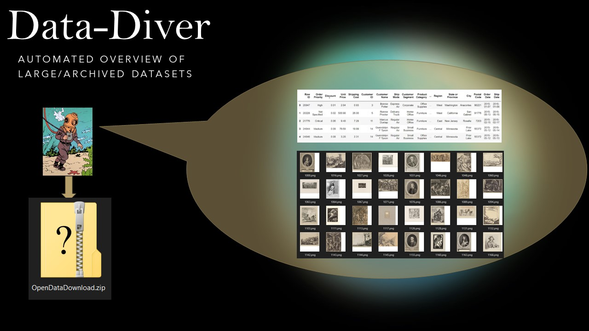

# [GLAMhack2021: Data-Diver](https://hack.glam.opendata.ch/project/116)
_Automatically generate an overview of open source datasets_

Project for [GLAMhack 2021](https://hack.glam.opendata.ch/) ( [#GLAMhack2021](https://twitter.com/search?q=GLAMhack2021) ) Fri 16th April - Sat 17th April

# About

Finding and viewing open datasets can be time consuming. Datasets can take a long time to download, and after exploring them you realise it is not in the form you needed.

The idea is to create a tool that could run on open data providers' servers, but also on a local computer, which automatically generates an overview of the files, images and along with summary statistics.

# Implementation

Aim to create a containerised process that takes a locally available filepath and returns a html page or json with:
* collage of example images
* numbers of each file types
* if csv's are present create summary statistics with data quality 

## How it Works

### as serverside microservice  

to follow

### as locally run app
to follow

# To Do 

[X] get list of file in a zip (without unzipping it)  
[X] return numbers of files in a zip (without unzipping it)  
[ ] use print statements to create a report in json
[ ] generate report as standalone html file  
[ ] create flask endpoint that accepts filepath as parameter and return json summary and image collage
[ ] function to check file size of archive members before processing  
[X] make photo collage ( could unzip specific files )  
[ ] make image resolution summary function
[ ] add flags for input parameters to scripts
[ ] add summaries for csv files

**Further Steps**  
[ ] add support for tar files  
[ ] create microservice to run locally (e.g. Flask)  
[ ] containerise app with Docker  
[ ] decide if core functions should be split into a module   
[ ] test speed of different methods   

# Notes/References

project gdrive folder: https://drive.google.com/drive/u/0/folders/1NbOzxm78wAVe_ZJaiIUvrIm42m__ndFU

zipfile module: https://docs.python.org/3/library/zipfile.html  

